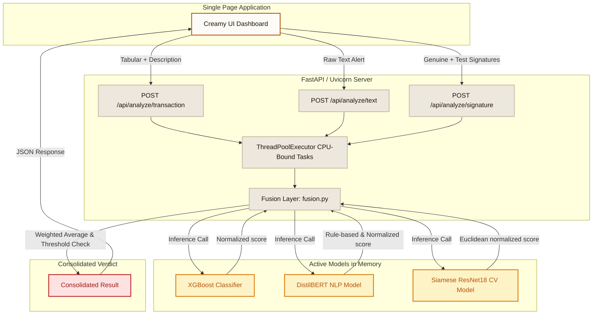

# AI-Powered Financial Fraud Detection System

> [!IMPORTANT]
> ## 📦 Dataset & Pre-trained Models — Google Drive
>
> **`DATASET.zip`** and **`MODELS.zip`** are **not included in this repository** due to file size limits.  
> They are hosted on **Google Drive** for easy download.
>
> | File | Description | Download Link |
> | :--- | :--- | :--- |
> | **DATASET.zip** | All training datasets (tabular, NLP, signature) | **[Add Google Drive link here](#)** |
> | **MODELS.zip** | Pre-trained XGBoost, DistilBERT & Siamese ResNet18 checkpoints | **[Add Google Drive link here](#)** |
>
> After downloading, extract **`DATASET.zip`** into `data/` and **`MODELS.zip`** into `models/` before running the app or training scripts.

---

> A Multi-Modal Real-Time Anti-Fraud Pipeline Powered by FastAPI, XGBoost, DistilBERT, and Siamese ResNet18.

---

## Intro Paragraph
This repository implements an enterprise-grade multi-modal fraud detection system. It ingests tabular credit card transactions, text alerts/emails, and signature scans, passing them through specialized ML, NLP, and CV models. The scores are combined via a dynamic fusion layer that renormalizes weights based on available inputs. The system features a responsive Single Page Application (SPA) web frontend styled with a premium off-white creamy visual identity, served asynchronously via FastAPI and Uvicorn.

---

## Table of Contents
1. [Features](#features)
2. [Tech Stack and Prerequisites](#tech-stack-and-prerequisites)
3. [Architecture Diagram](#architecture-diagram)
4. [Project Structure](#project-structure)
5. [User Instructions](#user-instructions)
6. [Developer Instructions](#developer-instructions)
7. [Contributor Expectations](#contributor-expectations)
8. [Known Issues](#known-issues)

---

## Features
* **Tabular Classifier (ML)**: XGBoost model trained on the ULB Credit Card dataset, utilizing scale-pos-weight to handle extreme class imbalance natively.
* **Phishing Text Detector (NLP)**: Fine-tuned DistilBERT transformer with calibrated thresholding (0.96) and heuristics to isolate true phishing from legitimate banking alerts.
* **Signature Verification (CV)**: Siamese neural network with a shared ResNet18 backbone using contrastive loss to compute Euclidean distances between genuine and test signatures.
* **Dynamic Fusion Layer**: Renormalizes weights on the fly if any module inputs (tabular features, text, or signature images) are omitted.
* **In-Memory Caching**: Implemented a caching mechanism for XGBoost, DistilBERT, and Siamese ResNet18 models, reducing inference latency to milliseconds by avoiding repeated disk loads.
* **Premium Creamy SPA**: Clean HTML5/CSS3 dashboard served via FastAPI using a warm beige, gold, and crimson color scheme.

---

## Tech Stack and Prerequisites

### Tech Stack
| Component | Technology | Version / Specifics |
| :--- | :--- | :--- |
| **Backend Framework** | FastAPI | Asynchronous Python framework |
| **Web Server** | Uvicorn | ASGI server implementation |
| **Tabular Model** | XGBoost | Classifier with SHAP explainability |
| **NLP Transformer** | Hugging Face Transformers | DistilBERT (`distilbert-base-uncased`) |
| **CV Architecture** | PyTorch / Torchvision | Siamese Network (ResNet18 backbone) |
| **Data Processing** | Pandas, NumPy, Scikit-Learn | Preprocessing & Metrics evaluation |

### Prerequisites
* **Operating System**: Windows, macOS, or Linux
* **Python**: Version `3.10` or higher
* **Hardware**: CUDA-compatible GPU (optional, fallbacks to CPU automatically)

---

## Architecture Diagram

The diagram below details the ingestion, processing, and score fusion pipeline:



---

## Project Structure
```text
AI-Fraud Detection System/
├── app.py                     # FastAPI application entrypoint
├── requirements.txt           # Virtual environment dependencies
├── train_all.py               # Combined training script for all 3 models
├── retrain_ml.py              # Standalone XGBoost retraining script
├── evaluate_models.py         # Evaluates metrics across all active models
├── models/                    # Serialized checkpoints and metric metadata
│   ├── distilbert_fraud/      # Fine-tuned DistilBERT directory
│   ├── xgboost_fraud.ubj      # XGBoost model binary
│   ├── siamese_resnet18.pt    # Siamese ResNet18 PyTorch state dict
│   ├── scaler.pkl             # Scaler checkpoint for Time/Amount
│   ├── ml_metrics.json        # Optimal threshold & performance metrics
│   └── nlp_metrics.json       # Calibration threshold & metrics
├── src/                       # Source modules
│   ├── data_preprocessing.py  # Dataset loading & split splits
│   ├── ml_model.py            # XGBoost train, predict, SHAP
│   ├── nlp_model.py           # DistilBERT train, calibrate, predict
│   ├── cv_model.py            # Siamese train, contrastive loss, predict
│   ├── fusion.py              # Normalized score fusion combiner
│   └── utils.py               # Shared logger and curve plotters
├── static/                    # Frontend assets
│   ├── style.css              # Creamy off-white design stylesheet
│   ├── main.js                # Frontend controllers and presets
│   └── icon.png               # Application logo and favicon
└── templates/                 # Frontend views
    └── index.html             # Asynchronous Single Page Application
```

---

## User Instructions

### Setting Up
1. **Clone the repository and enter the project folder**:
   ```bash
   git clone https://github.com/Im-diablo/AI-Fraud-Detection-System.git
   cd "AI-Fraud Detection System"
   ```
2. **Install requirements**:
   ```bash
   pip install -r requirements.txt
   ```
3. **Download Datasets** (Requires Kaggle API setup, with `kaggle.json` in `~/.kaggle/`):
   ```bash
   kaggle datasets download -d mlg-ulb/creditcardfraud -p data/raw/ --unzip
   kaggle datasets download -d uciml/sms-spam-collection-dataset -p data/raw/ --unzip
   kaggle datasets download -d subhajournal/phishingemails -p data/raw/ --unzip
   kaggle datasets download -d robinreni/signature-verification-dataset -p data/raw/ --unzip
   ```
   > *Note*: If you do not have Kaggle API credentials, the training pipeline will automatically use synthetic data fallbacks so you can still run and validate the code.

### Running the System
1. **Train the models** (or skip to let the fallback synthetic generation handle validation):
   ```bash
   python train_all.py
   ```
2. **Start the FastAPI local development server**:
   ```bash
   uvicorn app:app --host 127.0.0.1 --port 8000 --reload
   ```
3. **Open the Dashboard**:
   Go to `http://127.0.0.1:8000` in your web browser.

---

## Developer Instructions

### Working with the Model Cache
Each model (`ml_model.py`, `nlp_model.py`, `cv_model.py`) contains a module-level dictionary cache (e.g. `_NLP_CACHE`). This keeps the models pinned in memory within the Uvicorn worker process. When making changes to the prediction methods:
* Do not call `load_model` repeatedly in loops.
* If you modify model weights on disk, trigger a server restart or file reload so the cached model references are re-initialized.

### Adjusting Model Thresholds
* **XGBoost (ML)**: Use the sidebar slider to control the cutoff. This patches `ml_metrics.json` dynamically.
* **DistilBERT (NLP)**: The threshold is configured at `0.96` in `models/nlp_metrics.json` under `nlp_threshold`. This is normalized to `0.5` inside the model output loop to prevent false-positives on transactional SMS templates containing links.

---

## Contributor Expectations
* **Style Guidelines**: Follow PEP 8 style standards for Python code. Maintain clear division lines in modules.
* **Testing Changes**: Run testing pipelines before commits:
  ```bash
  python evaluate_models.py
  ```
* **Git flow**: Create feature branches off `main` and submit clean Pull Requests. Preserve existing comments and logging statements.

---

## Known Issues
* **First Inference Cold Start**: When starting Uvicorn, the first transaction check, NLP check, or signature check might take 1–3 seconds while PyTorch and XGBoost load model parameters from disk into memory. Subsequent runs are near-instant (<50ms).
* **Mislabeled SMS alerts**: The public SMS spam training dataset labels legitimate notifications (like standard OTP texts) as spam. We address this using the calibrated rule-based heuristics layer in `nlp_model.py`.

---

Made With 💗 by BlaZe
